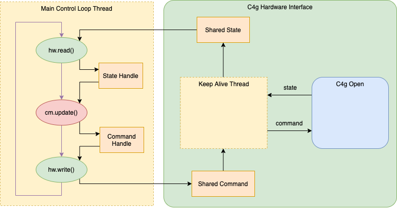

# **ROS Control Architecture**

## ROS control overview


 The ros_control framework provides the capability to implement and manage robot controllers with a focus on both real-time performance and sharing of controllers.

 The framework implements solutions for controller-lifecycle and hardware resource management as well as **abstractions on hardware interfaces** with minimal assumptions on hardware or operating system.

 Controllers expose standard ROS interfaces for out-of-the box 3rd party solutions to robotics problems like manipulation path planning (*MoveIt!*).

 ros_control also provides **several libraries to support writing custom controllers.**

 Reference:

- <http://wiki.ros.org/ros_control>

### Hardware Abstraction Layer

 The backbone of the framework is the **Hardware Abstraction Layer**, which serves as a bridge to different simulated and real robots. This abstraction is provided by the `hardware_interface::RobotHW` class, specific robot implementations have to inherit from this class. Instances of this class model hardware resources provided by the robot such as electric and hydraulic actuators and low-level sensors such as encoders and force/torque sensors. It also allows for integrating heterogeneous hardware or swapping out components transparently whether it is a real or simulated robot.

The rest of the `hardware_interface` package defines read-only or read-write typed joint and actuator interfaces for abstracting hardware away, e.g. state, position, velocity and effort interfaces. Through these typed interfaces this abstraction enables easy introspection, increases maintainability and allows controllers be hardwre-agnostic.

### The Controller Manager

The `controller_manager` is responsible for managing the lifecycle of controllers, and hardware resources through the interfaces and handling resource conflicts between controllers. The lifecycle of controllers is not static. It can be queried and modified at runtime through standard ROS services provided by the `controller_manager`. Such services allow to start, stop and configure controllers at runtime.

### Available controllers

The repository [`ros_controllers`](https://github.com/ros-controls/ros_controllers) holds several ready-made controllers supporting the most common use-cases for manipulators, mobile and humanoid robots, e.g. the `joint_trajectory_controller` is heavily used with position-controlled robots to interface with MoveIt!.

**It is possible to create your own too**, in order to be not limited to the controllers available in the repository.

## C4G Hardware Interface Library



The scheme above represents the software structure of the C4g Hardware Interface library. Here follows a brief legend to better understand the architecture:

- rounded rectangles represent the classes;
- dashed line yellow rectangles represent the threads;
- orange rectangles represent the data;
- ellipses represent control flow actions;
- green color is used for the C4g Hardware Interface class and methods;
- red color is used for the Controller Manager method;
- black arrows represent the data flow;
- violet arrows represent the control flow.

### Purpose of the library

The developed library **allows to integrate all the functionalities provided by the C4G Open Library** in the ROS control framework.
Using the `C4gHardwareInterface` class it is possible to make the C4G Open Library transparent to ROS.

### The C4gHardwareInterface Class

The hardware interface is used by `ros_control` in conjunction with one of the `ros_controllers` to send and receive commands to hardware. It must implement the `joint_command_interface` to support commanding an array of joints and the `joint_state_interface` to support reading the state of an array of named joints.

The `c4g_hardware_interface` must therefore implement these methods:

- `bool init()`

Starts a thread that keeps the communication alive between the Comau C4G controller (using the package `c4g_open_driver`) and the user application.

- `void read()`

Update the joint positions read from the C4G controller and make them available to the `ros_controllers`.

- `void write()`

Update the joint positions read from the `ros_controllers` and forward them to the C4G controller.

**IMPORTANT NOTE**: *The communication between the ROS application and the Comau C4G control unit can be made real-time safe through the usage of a real-time kernel, like PREEMPT-RT, and the `c4g_open_driver` package. However, **the control loop period is custom**, you can define your own*.

### Conversions from radians to motor revolutions (and vice versa) and from meters to motor revolutions (and vice versa)

The C4g Driver receives and sends joints positions as motor revolutions. The `C4gHardwareInterface` converts these values to radians (for the joints from 1 to 6) and to meters (for the joint 7, the slide).

For the joints from 1 to 6, the conversion used is described at the end of chapter 19 of [C4g System Software](../c4g_open_driver/doc/lb-rc-c4e-c4gopen_en.pdf).

For the joint 7 the used conversion is different since the motor revolutions have to be converted into meters.

### Main control loop

Generally, for ROS-ready robots, the main control loop node is provided by the manufacturer. Thus, besides the hardware interface, this package must also provide the main control loop node such that it complies with the standard `ros_control` mechanism.

You can find the main control loop [here](src/main_loop.cpp).

## Yaml, configuration and launch files

The following configuration and script files are also provided in this package:

- The `c4g_controllers.yaml` file contains the configuration for the available ROS controllers.

- The `c4g_hardware_interface.yaml` file contains the definition of the joints and the control loop frequency.

Launch files are also provided to test the architecture. For further information see section [Test the architecture](#test-the-architecture).

## Build the package

Run

```bash
catkin build c4g_hardware_interface
```

in order to compile the package.

Then, do not forget to source:

```bash
source <path_to_workspace>/devel/setup.bash
```

## Test the architecture

### The `namespace` parameter

The `namespace` parameter can be used to set the node namespace and it is present in every [launch](launch/) file of the
package.
This becomes necessary in order to command two Comau Smart-Six in a coordinated fashion.

**NOTE:** the chosen namespace parameter must end with a `/`.

### Start the communication with a C4G control unit

Open a new console and type the following command:

```bash
roslaunch c4g_hardware_interface c4g_main_control_loop.launch
```

Set the `startup` as PDL2 starting program of the C4G control unit, then start the C4G control unit and wait the start of the communication.

When the communication starts you can read the message:

```text
[ INFO] [1631787226.159332102]: Drive On the robot and set mode 4 via PDL2
[ INFO] [1631787226.159366238]: Wait for mode 4
```

Execute `setMode4` script on the C4G controller, after which the following message will appear on the console:

```text
[ INFO] [1634890938.776506150]: Mode 4 active. Ready to receive commands.
```

### Get the joint state

If you want to read the joint positions, open a new console and load the `joint_state_controller`, otherwise skip this code section.

```bash
roslaunch c4g_hardware_interface c4g_state_controller.launch namespace:=$(rosparam get /namespace)
rostopic echo $(rosparam get /namespace)joint_states
```

### Move the robot

If you want to move the robot, you can use the demo inside the package. This demo uses the `pos_joint_group_controller`
to send the joint positions to the robot, while a trajectory planner makes a sinusoidal movement for each joint and sends
it to the `pos_joint_group_controller`.

To load the position controller:

```bash
roslaunch c4g_hardware_interface c4g_ros_control_online_demo.launch namespace:=$(rosparam get /namespace)
```

This also loads the `joint_state_controller`, so that the trajectory planner can make the movement with respect to the current position of the robot. To start the trajectory planner:

```bash
rosrun c4g_hardware_interface demo_c4g_trajectory_planner
```

If you want to manually control the joint positions, you can do it by loading the `joint_trajectory_controller` and the `rqt_joint_trajectory_controller`:

```bash
roslaunch c4g_hardware_interface c4g_ros_control_manual.launch namespace:=$(rosparam get /namespace)
```

If you want to execute an offline-planned trajectory with the `JointTrajectoryController`, run

```bash
roslaunch c4g_hardware_interface c4g_ros_control_offline_demo.launch namespace:=$(rosparam get /namespace)
```

Trajectories can be sent to the `$(rosparam get /namespace)pos_joint_traj_arm_controller/follow_joint_trajectory` topic. For an example with an identification trajectory, see the [`exciting_trajectory_planning_and_execution`](../exciting_trajectory_planning_and_execution/) package.

**ATTENTION**: Make sure the robot is at the initial waypoint before executing the trajectory.

### Stop the communication

To stop the communication Drive OFF the robot and set mode 504. Then you can simply shutdown the C4G control unit and in the first console you will read:

```text
[ INFO] [1631788078.726156832]: Communication with C4G interrupted
[ INFO] [1631788078.726205522]: Communication thread ended
```

## Test the architecture with a gripper

### The `load_gripper` argument

The `load_gripper` argument accepts a boolean value.
By default it is `false`, meaning that no gripper must be loaded.
In that case refer to the [Test the architecture](#test-the-architecture) section.

### Connect with the gripper

1. Connect the NI-USB 6525 device to the computer.

2. Grant the driver permissions to send bulk transfer messages on the USB:

    ```bash
    sudo chmod -R 777 /dev/bus/usb/
    ```

### Start the communication with a C4G control unit and the gripper

Open a new console and type the following command:

```bash
roslaunch c4g_hardware_interface c4g_main_control_loop.launch load_gripper:="true"
```

Refer to the [Test the architecture](#test-the-architecture) section for additional information on how to properly set up the communication with the robot.

Then, load the controllers for the gripper, by opening a new console and typing the following command:

```bash
roslaunch open_close_gripper_controller demo_open_close_gripper_controller.launch
```

You can now command the gripper via `rqt_publisher`. Refer to the gripper's controller [Readme](/open_close_gripper_controller/Readme.md) for specifics on the type of message to send.

## Test the double-C4G architecture

ROS can run across multiple machines in a distributed fashion.
You may want to check out the ROS [tutorial](http://wiki.ros.org/ROS/Tutorials/MultipleMachines) for further information.

In order to validate this double-C4G architecture it is necessary to follow the steps below.

### Setup the architecture

1. Synchronize the master and slave PC's with `chrony` by following the [tutorial](../husky_acg_configuration/doc/chrony_tutorial.md).

1. Establish the name of the master PC and the IP address related to it.

1. Ensure, on the slave PC, that the IP address of the master PC is listed in the file `/etc/hosts`.

    It is possible to visualize the latter through the command:

    ```bash
    cat /etc/hosts
    ```

    In particular, you need to verify that the following line is present:

    ```text
    193.205.164.39 PCAUT-06
    ```

    If the latter is not listed, you need to edit the file `/etc/hosts`, by adding it. In order to modify the file, run the command:

    ```bash
    sudo nano /etc/hosts
    ```

1. Verify that the name of the master PC, corresponding to the variable `ROS_MASTER_URI`, is present at line 3 of the [scripts.bash](./scripts/setup.bash) file.
Specifically, with the current configuration used, the corresponding line is as follows:

    ```bash
    export ROS_MASTER_URI=http://PCAUT-06:11311
    ```

1. In the file [scripts.bash](./scripts/setup.bash), on line 4, set the name of the Ethernet interface connected to the network.
The current configuration is the following:

    ```bash
    ETH_INTERFACE=enp2s0
    ```

   **NOTE:** On the PC, there are multiple Ethernet interfaces, as one is used to connect to the network and one to the robot.
   So, the latter should not be used, but the former.

1. Configure the slave PC to use the ROS master located on the master PC with

    ```bash
    catkin build c4g_hardware_interface -DMULTIPLE_ARMS=ON
    ```

    and source the workspace.

1. On the master PC, start the communication with the master robot following the commands of the ["Start the communication with a C4G control unit"](#start-the-communication-with-a-c4g-control-unit) section.
Specifically, you have to execute:

    ```bash
    roslaunch c4g_hardware_interface c4g_main_control_loop.launch namespace:=/master/
    ```

1. Start the communication with the slave robot on the slave PC (like done with the master at step `6` of [this section](#setup-the-architecture)).
Specifically, execute:

    ```bash
    roslaunch c4g_hardware_interface c4g_main_control_loop.launch namespace:=/slave/
    ```

    When you start the main control loop on the slave PC, by executing the previous command, the following line is present on the terminal:

    ```text
    ROS_MASTER_URI=http:://PCAUT-06:11311
    ```

1. At this point, the slave robot should be visible on the master PC and vice versa.
For example, this should be the output of the `rosnode list` command executed on the master PC and on the slave PC:

    ```text
    /master/c4g_hardware_interface
    /rosout
    /slave/c4g_hardware_interface
    ```

### Command the robots

With this configuration it is possible to control both the master robot and the slave robot from the master PC.
To do this, the aforementioned [launch](launch/) files can be used.

**NOTE:** remember to use the proper [namespace](#the-namespace-parameter) parameter.

For example, if you want to manually control the positions of the slave robot joints, you can do it by loading the `joint_trajectory_controller` and the `rqt_joint_trajectory_controller`:

```bash
roslaunch c4g_hardware_interface c4g_ros_control_manual.launch namespace:=/slave/
```

#### Command the robots in a coordinated fashion

1. For extra security, it is suggested to start the ROS master, by executing the command:

    ```bash
    roscore
    ```

    It is recommended to perform this step, as if it is necessary to kill the main control loop on the master PC, it is possible to stop only the latter, without killing the ROS master as well.
    Otherwise by stopping the main control loop from the master PC, the communication from the latter to the slave PC is lost.
    In this case, you need to perform again the steps 6, 7, 8 in the [Setup the architecture section](#setup-the-architecture).

2. Define the bagfile containing the trajectories which you want to execute.
Specifically, the bagfile must contain 2 messages on 2 different topics, one corresponding to the master robot and one to the slave robot.
This bagfile is stored in the [bagfiles](./bagfiles/) directory.

3. Verify the first waypoint of both the trajectories to be executed on the master robot and on the slave robot.

4. Bring the master robot and the slave robot to the positions corresponding to the first waypoint of the related trajectories, through the `rqt_joint_trajectory_controller`, like in the [Move the robot](#move-the-robot) section, by using the proper [namespace](#the-namespace-parameter) parameter.

   **NOTE:** The initial joint positions, where to take the master and slave robots, are provided in the [`Readme.md`](./doc/Readme.md).
   If you want to command the robots in a coordinated fashion, you have to consider the rows related to both master robot and slave robot.

5. To command two Comau Smart-Six in a coordinated fashion, you have to execute from the master PC:

    ```bash
    roslaunch c4g_hardware_interface c4g_ros_control_offline_demo.launch namespace:=/master/
    ```

    and

    ```bash
    roslaunch c4g_hardware_interface c4g_ros_control_offline_demo.launch namespace:=/slave/
    ```

    At this point, if you execute on the master PC the command:

     ```bash
     rosnode list
     ```

    on the terminal, you should to see

    ```text
    /master/c4g_hardware_interface
    /master/ros_control_controller_spawner
    /rosout
    /slave/c4g_hardware_interface
    /slave/ros_control_controller_spawner
    ```

    Instead, if you execute the command:

     ```bash
     rostopic list
     ```

    on the terminal, you should to see

    ```text
    /master/joint_states
    /master/pos_joint_traj_arm_controller/command
    /master/pos_joint_traj_arm_controller/follow_joint_trajectory/cancel
    /master/pos_joint_traj_arm_controller/follow_joint_trajectory/feedback
    /master/pos_joint_traj_arm_controller/follow_joint_trajectory/goal
    /master/pos_joint_traj_arm_controller/follow_joint_trajectory/result
    /master/pos_joint_traj_arm_controller/follow_joint_trajectory/status
    /master/pos_joint_traj_arm_controller/state
    /rosout
    /rosout_agg
    /slave/joint_states
    /slave/pos_joint_traj_arm_controller/command
    /slave/pos_joint_traj_arm_controller/follow_joint_trajectory/cancel
    /slave/pos_joint_traj_arm_controller/follow_joint_trajectory/feedback
    /slave/pos_joint_traj_arm_controller/follow_joint_trajectory/goal
    /slave/pos_joint_traj_arm_controller/follow_joint_trajectory/result
    /slave/pos_joint_traj_arm_controller/follow_joint_trajectory/status
    /slave/pos_joint_traj_arm_controller/state
    ```

6. At this point, from the master PC, it is possible to send the trajectories, stored in the bagfile defined in the step `2` of [this section](#command-the-robots-in-a-coordinated-fashion).
In order to do this, you have to move in the [bagfiles](./bagfiles/) directory and execute:

    ```bash
    rosbag play c4g_master_and_slave_lift_trajectories.bag
    ```

## Known issues

If you get the following error on the teach pendant

``` text
PowerFailure in errore per batteria scarica dopo 0 secondi.
```

the `setMode4` cannot be executed and you necessarily need to restart the C4G and launch `c4g_main_control_loop.launch` again.
